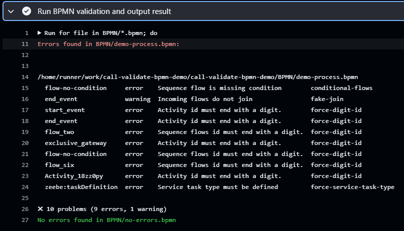

# Reusable GitHub Action for validating BPMN process models.

This GitHub Action workflow is designed to streamline the validation process for BPMN files using the bpmn linter provided by [bpmn-io](https://github.com/bpmn-io). It enables you to validate your BPMN files and incorporate user-defined rules.

## Usage

To use this workflow, follow these steps:

1. **Create a Workflow YAML File**

   To create a GitHub workflow file, navigate to your repository's `Actions` tab, click "New workflow," select "Set up a workflow yourself," define your workflow using YAML syntax, and commit the file to the `.github/workflows` directory for automated execution based on events or schedules. Customize as needed.

   Alternatively, create a `.github/workflows` directory in your repository (if not already present). Inside this directory, create a file named `main.yml`.

2. **Add the Workflow Configuration**

   Open the `main.yml` file and paste the following code:

   Make sure to replace the placeholder paths (`'path/to/your/bpmn-files-folder'`, `'path/to/your/custom_rules-folder'`, `'path/to/your/.bpmnlintrc-file'`) with the actual paths in your repository.

   Information on how to setup bmlint to utilize custom rules can be found here: [bpmn-io](https://github.com/bpmn-io/bpmnlint)

   ```yaml
   name: Call apendo-c8/validate-bpmn-model GitHub Action

   on:
     push:
       branches:
         - main

   jobs:
     call-BPMN-validate-workflow:
       permissions:
         contents: read
       uses: apendo-c8/validate-bpmn-model/.github/workflows/main.yml@main

       with:
         bpmn-file-path: 'path/to/your/bpmn-files-folder'
         custom-rules-folder: 'path/to/your/custom_rules'
         bpmnlintrc-path: 'path/to/your/.bpmnlintrc'
   ```

## View the Validation Result

After each workflow run (this utilizes on: push) [variants here](https://docs.github.com/en/actions/using-workflows/workflow-syntax-for-github-actions), you can find the result of the validation under the step called `Run BPMN validation and output the result` under `Actions` tab click the corresponding workflow run. The result of the validation is found under the step "Run BPMN validation and output the result"
tab of your repository.

## Example


